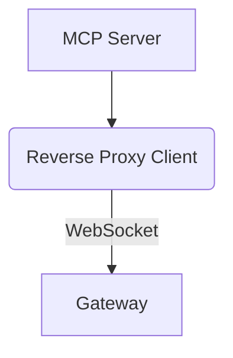

### Type of Feature

Please select the most appropriate category:

- [ ] Enhancement to existing functionality
- [ ] New transport (MCP server side or gateway side)
- [ ] CLI or configuration improvement
- [ ] New component or integration
- [ ] Developer tooling or test improvement
- [ ] Packaging, automation and deployment (ex: PyPI, containers)
- [ ] Other (please describe below)

### Epic

**Title:** <High-level feature or capability>
**Goal:** What is the big-picture objective of this feature?
**Why now:** Why is this needed? Who benefits?

---

### User Story

**As a:** <type of user>
**I want:** <some goal>
**So that:** <some reason / value>

#### Acceptance Criteria
```gherkin
Scenario: First scenario title
  Given some starting state
  When an action occurs
  Then a result should happen
```

---

### Design Sketch (optional)

Include a diagram, sketch, or flow (use [Mermaid](https://mermaid.js.org/) if desired):



---

### MCP Standards Check

- [ ] Change adheres to current [MCP specifications](https://modelcontextprotocol.io)
- [ ] No breaking changes to existing MCP-compliant integrations
- [ ] If deviations exist, please describe them below:

---

### Alternatives Considered

List any alternative designs, existing workarounds, or rejected ideas.

---

### Additional Context

Include related issues, links to discussions, etc.
